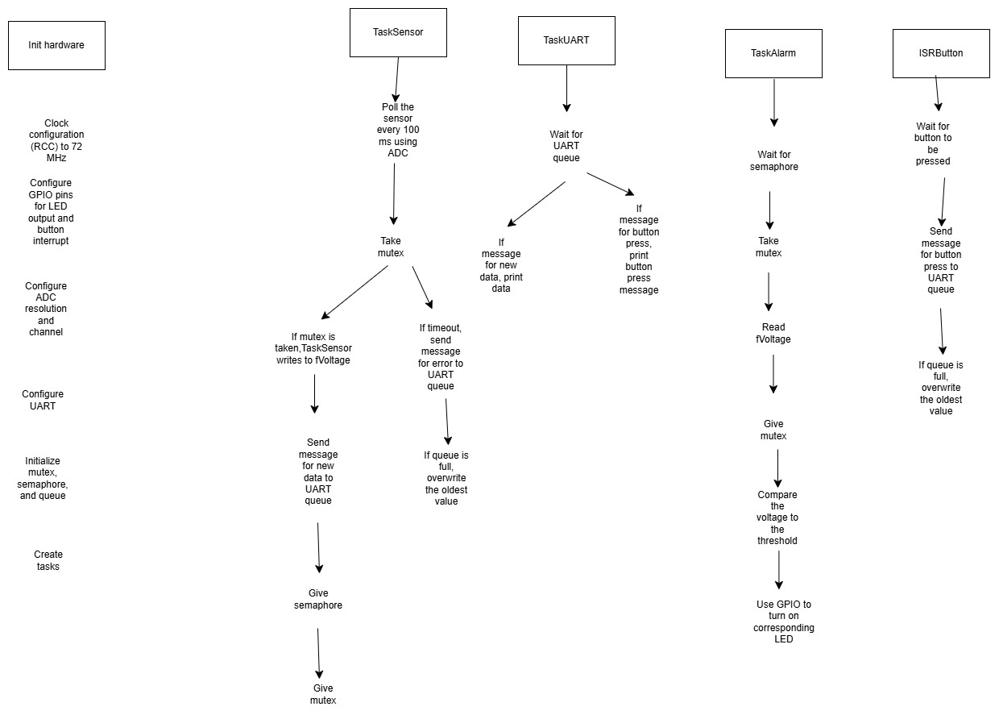

 

# Components

## Tasks

|Name|Priority|Stack Size|Periodicity/Trigger|Description|
|--|--|--|--|--|
|`static TaskHandle_t xTaskSensor`|Low|128 words|100 ms|Monitor voltage using ADC|
|`staticTaskHandle_t xTaskAlarm`|High|128 words|Event-driven (sensor update)|Control LEDs|
|`static TaskHandle_t xTaskUART`|Medium|128 words|Event-driven (sensor update)|Transmit data|

- **Static:** limit variable's scope to `main.c` file for encapsulation

## Concurrency and Synchronization

|Component|Description|
|--|--|
|`SemaphoreHandle_t xMutex`|Manage shared access for `fBatteryVoltage`|
|`SemaphoreHandle_t xBinSemaphore`|Wake up `TaskAlarm` only when there is new data|
|`QueueHandle_t xUARTQueue`|Queue to send messages to `TaskUART`|

## Variables

|Variable|Description|
|--|--|
|`volatile float fBatteryVoltage`|Battery voltage read by ADC|
|`const float fThresholdVoltage`|Threshold for lighting up green/red LED|
|`volatile uint32_t currentTime`|Button debouncing|
|`volatile uint32_t prevTime`|Button debouncing|

- **Volatile:** ensure compiler doesn't optimize read/writes


## Diagram



## Notes

- Why does TaskSensor gives the semaphore before giving the mutex?
  - Prevent tasks from fighting over the mutex before they are "synced" by the semaphore
  - Give the semaphore first to let the scheduler organize the ready tasks 
- Why statically allocate tasks, mutexes, and semaphores?
  - Ensures determinism, no risk of runtime memory allocation failure

## Messages

```c
typedef enum {
    MSG_TYPE_VOLTAGE,
    MSG_TYPE_BUTTON
} MsgType_t;

typedef struct {
    MsgType_t type;    
    float value;       
} UARTMsg_t;
```

## ADC
- **Resolution:** 12 bits
- **Sampling rate:**
- **Trigger source:** software

## UART
- **Baud rate:** 115200 bits/s
- **Word length:** 8 bits
- **Parity:** no parity 
- **Stop bits:** 1

## GPIO

|Pin|Component|Description|
|--|--|--|
|PA5|GPIO_Output|Write to green LED|
|PA6|GPIO_Output|Write to red LED|
|PC13|GPIO_Input|Button press and interrupt|
|PA2|USART_Tx|Transmit data from STM32|
|PA3|USART_Rx|Transmit data to STM32|
|PC1|ADC1_IN11|Read voltage value|
|3.3V|n/a|Power the potentiometer and LEDs|
|GND|n/a|Ground|


## Next Steps
- BME280: I2C
- 74HC595: SPI, 7-segment display
- Buzzer: PWM tones
- Make a diagram in Altium