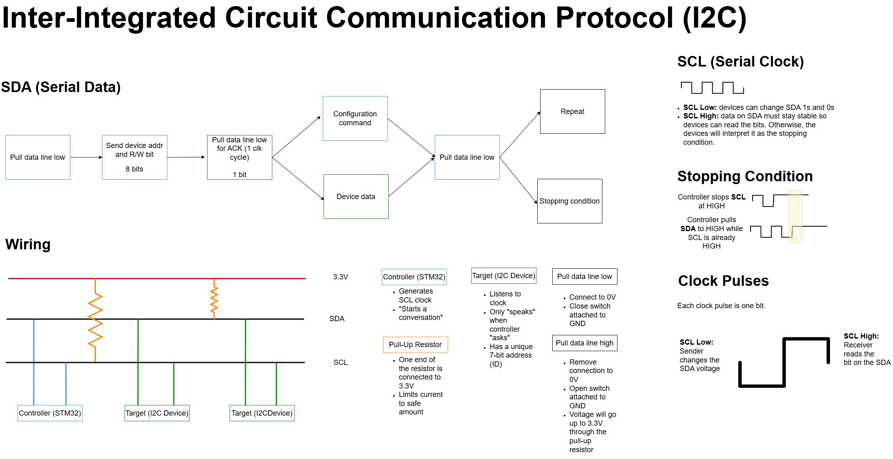

# Environment Manager

## I2C

Notes

## BPM180 Sensor

Datasheet: https://cdn-shop.adafruit.com/datasheets/BST-BMP180-DS000-09.pdf

### I2C

Address + W/R: `1110111` + `0/1`

Write: `0xEE`, 
Read: `0xEF`

### Registers
|Name|Bin|Hex|Description|
|--|--|--|--|
|`ctrl_meas` |11110100|0xF4|Tells sensor when to wake up and what to measure|
|MSB|11110110|0xF6|MSB of temperature or pressure value|
|LSB|11110111|0xF7|LSB of temperature or pressure value|
|XLSB|11111000|0xF8|(Optional) XLSB of temperature or pressure value|

### Values for Control Register

|Measurement|Bin|Hex|Control Register|
|--|--|--|--|
|Temperature|00101110|0x2E|`ctrl_meas`|
||||

### Measurements

**Uncompensated temperature (UT) and uncompensated pressure (UP):** raw values in bits

### Hardware

- Pull-up resistors for SCL and SDA: 4.7 

### Calibration

Every time the STM32 boots up, the calibration data must be read from the EEPROM.

**EEPROM:**
- Electrically erasable programmable read-only memory
- Retains data when power is lost
- Non-volatile, byt-addressed