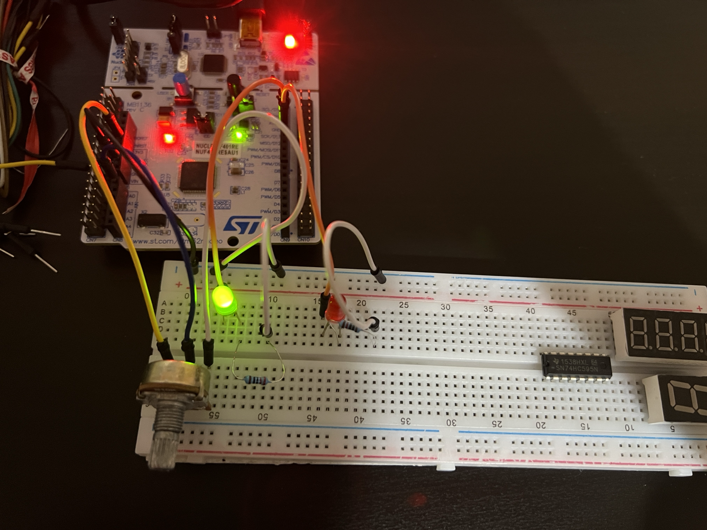
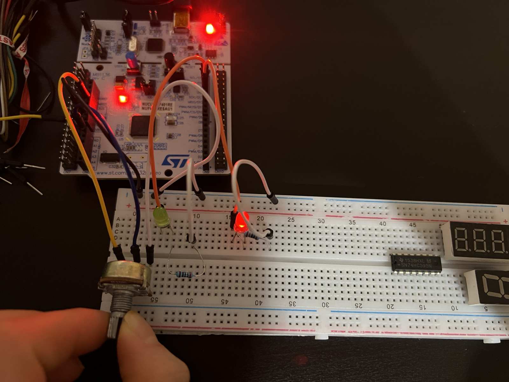
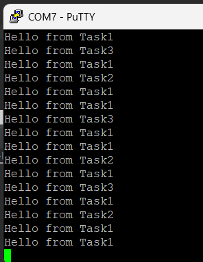

### Jan 24, 2026

- Set up circuit to use ADC polling to choose an LED depending on potentiometer value
- Set up 3 FreeRTOS tasks and got each one to print at UART every 1, 2, or 3 seconds

### Jan 23, 2026

- Updated documentation for ADC, interrupts, and polling

### Dec 26, 2025

- Control LED brightness with potentiometer, PWM, and ADC

### Dec 23, 2025

- Set up project in STM32CubeIDE and STM32CubeMX
- LED circuit to test GPIO with simple blinking and PWM
- Configured Serial Wire Viewer for printf 
- Simple ADC and potentiometer circuit

 