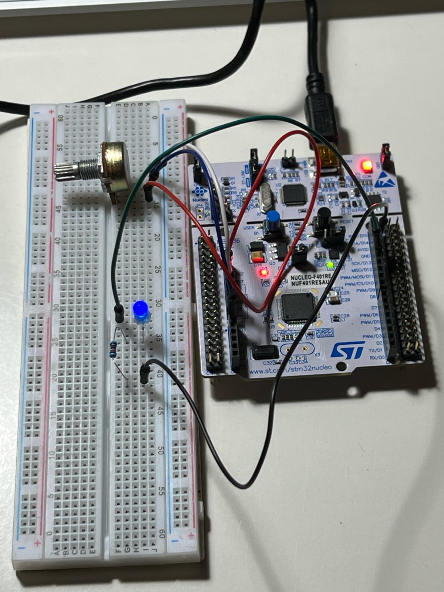
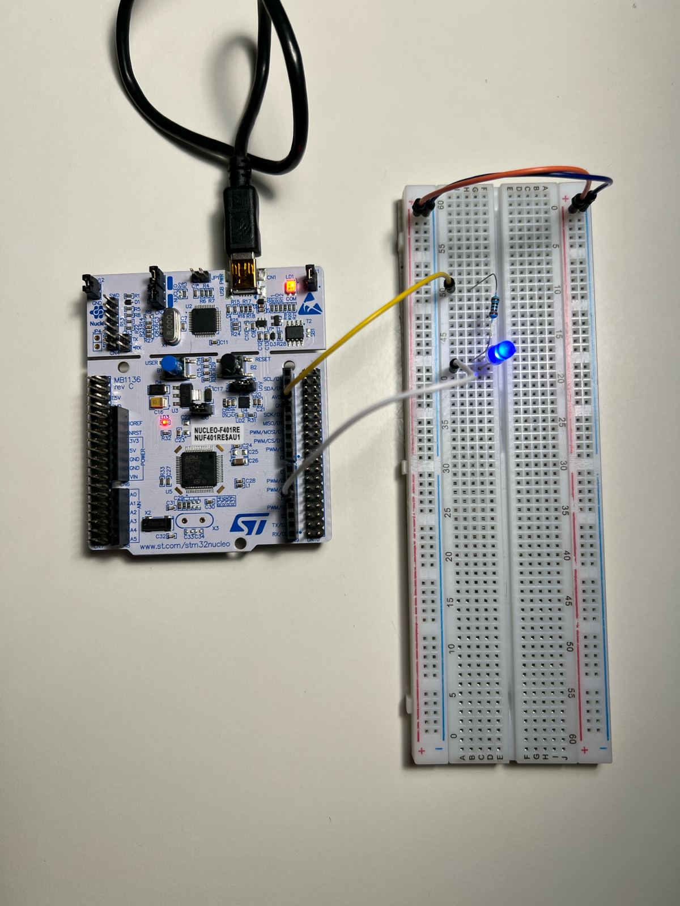
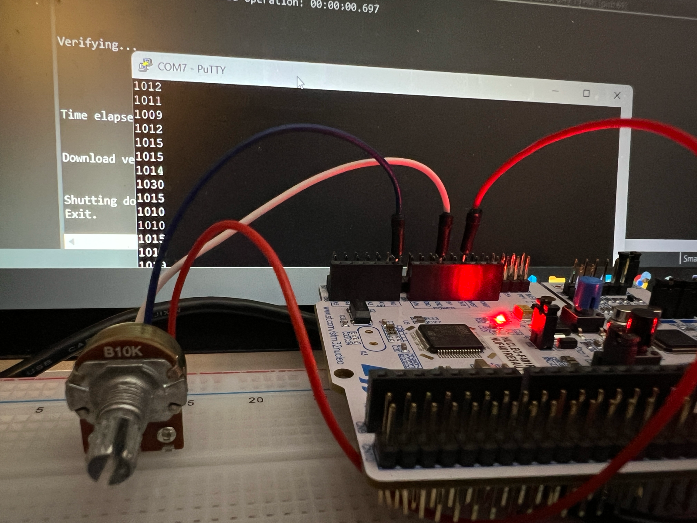

### Dec 26, 2025

- Control LED brightness with potentiometer, PWM, and ADC

### Dec 23, 2025

- Set up project in STM32CubeIDE and STM32CubeMX
- LED circuit to test GPIO with simple blinking and PWM
- Configured Serial Wire Viewer for printf 
- Simple ADC and potentiometer circuit

 