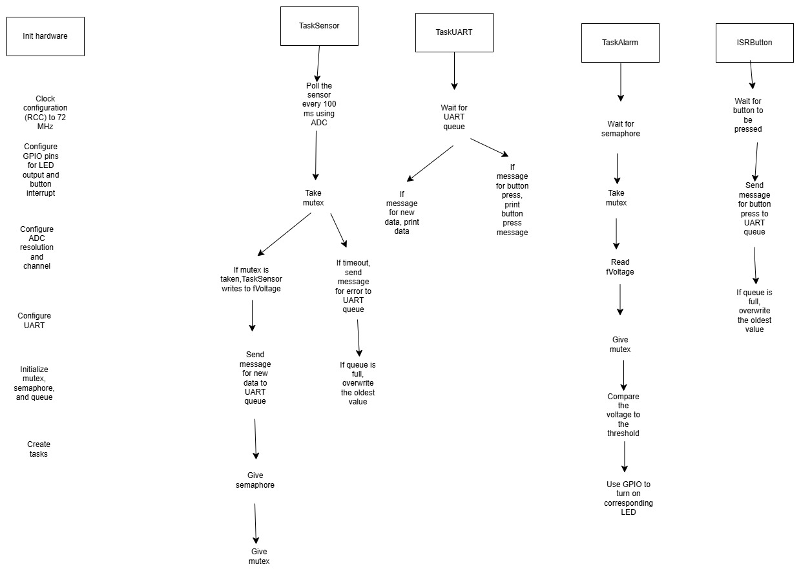

 

# Components

## Tasks

|Name|Priority|Stack Size|Periodicity/Trigger|Description|
|--|--|--|--|--|
|`TaskHandle_t xTaskSensor`|Low|128 words|100 ms|Monitor voltage using ADC|
|`TaskHandle_t xTaskAlarm`|High|128 words|Event-driven (sensor update)|Control LEDs|
|`TaskHandle_t xTaskUART`|Medium|128 words|Event-driven (sensor update)|Transmit data|

## Concurrency and Synchronization

|Component|Description|
|--|--|
|`SemaphoreHandle_t xMutex`|Manage shared access for `fBatteryVoltage`|
|`SemaphoreHandle_t xSemaphore`|Signal to wake up `TaskAlarm`|
|`QueueHandle_t xUARTQueue`|Queue to send messages to `TaskUART`|

## Diagram



## Notes

- Why does TaskSensor gives the semaphore before giving the mutex?
  -  Prevent tasks from fighting over the mutex before they are "synced" by the semaphore
  - Give the semaphore first to let the scheduler organize the ready tasks 

# Messages

```c
typedef enum {
    MSG_TYPE_VOLTAGE,
    MSG_TYPE_BUTTON
} MsgType_t;

typedef struct {
    MsgType_t type;    
    float value;       
} UARTMsg_t;
```

# Memory Management

# Peripheral Configuration

## ADC
- Resolution:
- Sampling rate:
- Trigger source:

## UART
- Baud rate:
- Parity:
- Stop bits:

## GPIO
Pin mapping table

Diagram in Altium